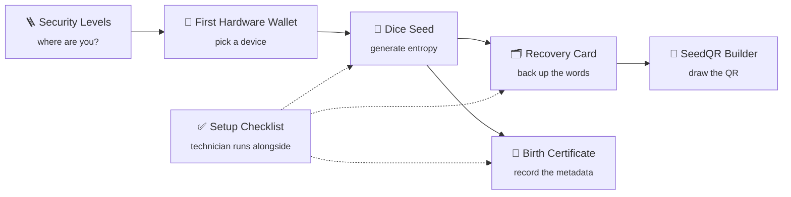

# ₿ The Bitcoin Hardware Store

**Self-custody tools, guides and printables from Playa El Zonte, El Salvador.**

Everything here is a single, self-contained file. No build step, no server, no tracking.
Open it in a browser and it works, even offline.

[tbhs.sv](https://tbhs.sv)

---

## 🧭 What's inside

### Learn

| | File | What it does |
|---|---|---|
| 🪜 | [**Bitcoin Security Levels**](bitcoinsecuritylevels.html) | Six levels from curious newcomer to gold-standard custody. Includes a quick "find your level" check, key-custody diagrams for each level, the time and cost of every climb, and the Legacy Encryption + Deploy inheritance protocol. |
| 🔐 | [**How to Get Your First Hardware Wallet**](firsthardwarewallet.html) | Client handout comparing three ways to get a first signing device, from DIY SeedSigner builds to off-the-shelf devices. |

### Create

| | File | What it does |
|---|---|---|
| 🎲 | [**Dice Seed Generator**](diceseed.html) | Turns physical dice rolls into a BIP39 seed phrase, fully offline. 12 words (50 rolls) or 24 words (99 rolls), with an optional checksum word. |

### Record

| | File | What it does |
|---|---|---|
| 📜 | [**Seed Birth Certificate**](seedbirthcertificate.html) | A "vital record" for a new wallet: birth date, entropy source, devices, firmware and fingerprint. Contains no secrets. Type into it or print it blank. |
| 🗂️ | [**Recovery Card**](recovery%20card.pdf) | Printable card with 24 numbered word lines, a fingerprint box, a QR grid and a passphrase line. |
| 🗂️ | [**Recovery Card · 25×25**](recovery%20card%2025x25.pdf) | Same card with a 25×25 SeedQR grid, the size a 24-word Compact SeedQR needs. Pair it with the SeedQR Builder. |
| 🔳 | [**SeedQR Builder**](seedqr.html) | Turns a 12 or 24 word seed into a hand-drawn Compact SeedQR, fully offline. Validates the checksum, shows the master fingerprint, guides you row by row through which squares to fill, and prints blank 25×25 / 21×21 grids. |

### Run a setup

| | File | What it does |
|---|---|---|
| ✅ | [**Full Self Custody Setup**](tbhschecklist.html) | Internal technician checklist, one sheet per client: generate the seed, verify the backup, export the xpub to Sparrow, verify and record. |

---

## 🛠️ How a client setup flows

---

## 🚀 Using the files

1. Download the file you need (or clone the repo).
2. Double-click it to open in any modern browser.
3. Printables (checklist, birth certificate, wallet guide) have a **Print / Save as PDF** button and print cleanly on US Letter.

> [!WARNING]
> **Generating a real seed with the Dice Seed Generator, or drawing one with the SeedQR Builder?** Disconnect from the internet or use an air-gapped computer, open the file from disk in a private window with extensions off, and roll real dice. Never screenshot or photograph the words. With your camera covered, write them on paper or metal, then close the tab.

> [!IMPORTANT]
> Seed words belong on your backup only, never on a screen, in a photo, in the cloud, or on any of these sheets.

---

**Not your keys, not your coins.**

The Bitcoin Hardware Store · TBHS SA de CV · Playa El Zonte, Chiltiupan, La Libertad, El Salvador

